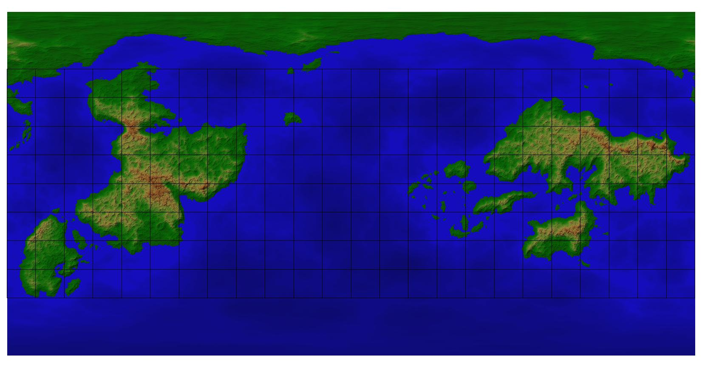

# Worldbuilding - New Map Started Oct 2019

I've been wanting to do a walkthrough of how I create maps using [FT3 (Fractal Terrains 3)](https://www.profantasy.com/products/ft.asp#&panel1-1) for some time now. So here we go!

> Note that GitHub isn't suitable for tracking a history of the actual FT# ap .ftw files, as they run big (mine are just under a G each). To do this at all would require the use of `git lfs`, however, the freebie space provided on GitHub for LFS is also only 1G, so unless you wanna pay for more space, this is a no-go. Since this is just a hobby for me, a separate file history in a folder works fine. 

Since I want to show how I evolve my map over time, I'm going to try to version images of the main map to show diffs as I edit. 

## Initial map

To start, I page through random maps in FT3 looking for one that doesn't overlap the edges much. (That's because the river functionality doesn't wrap around that break point so things can look weird.) This map was generated with the Wilbur Ridged Multifractal method.

### FT3 Settings
To edit the maps in FT3, I update the editing settings to have the Editing Size set to Custom: 8190. Also, check the box to "Allow Prescale Offset Editing".

## Polar Cleanup

The first edits I'll make are to tidy up what would currently be the northern pole landmass. I want to make it bigger and a bit more round, so I'll fill in some of the gaps between the points. To do this, I'll use the Raise Prescale Offset tool at a value of 0.0164042 (the default value with an extra 0 added after the decimal) and a width/heigh starting at 250 but varying the size as needed. To raise land out of the sea, I start more off-shore and work in to try and avoid a raised area at the old land/sea border.

> *Important:* You don't want to raise or lower too deeply at once, and you want to make the clicks in a non-linear pattern to avoid scarring or gouging on the map.

When editing the poles, you have to remember that the default map projection (equirectangular) has a lot of distortion at the poles. (As noted in the description in FT3: "Unfortunately, it distorts both shape and area, with the distortions increasing with increasing distance from the equator.") To get a more accurate sense of what these regions look like, switch to the Orthographic or Stereographic projections.

## Continent Cleanup

Before I start editing the continents, I need a guide to help me get a sense of size. To do this, I'll enable the FT3 Grid with lat/long at 15 deg marks. This helps me compare with this lovely map [equirectangular map of our planet on Wikipedia](https://en.wikipedia.org/wiki/Equirectangular_projection#/media/File:Equirectangular_projection_SW.jpg)

Right now, the continents are huge and clearly just a fractal generated mess. Based on what I know from looking at our own planet, the big blobs of mountains in the center of the land masses is just all wrong. (I make no claims of geological or planetary epertise, I only know what looks _natural_ to me.) So, I take some time to think about what I want to trim out first and just mark things up in Paint. 

From there, the idea is to lower, but not really flatten out the bulbous mountains and remove or add terrain as needed. Go slowly and save often. I often find I haven't saved as frequently as I wish I had. The undo buffer only goes so far, and I think that is lessened the more detailed the edit size.

Inevitably I end up wanting back some terrain that I earased early on. I thought at one point if I saved maps along the way I could cut/paste say a continent or island from an old one to a new one. Nope. Not easily anyway. There is a tool to save and load selections, but I can't get it to work across maps. Boo!

So here is what I've got once my continents shaped up to suit my asthetics. Don't get me wrong, they are still messy but at this point you just need the general shape and some higher areas where you want to leave mountains. I find it is better to exagerate the mountains, but I'm not worried about peaks yet. Just get the general placement there.

I never stick exactly to my plan.  It's more fun to get a little creative along the way.  ^.^

At this point I like to turn it into a spinning globe to get a sense of it all shaped up. Inevitably shapes I like on the rectangular projection don't turn out as I think when they are rounded. That's a pain in the butt, but part of making a global map. Of course sometimes I am pleasantly surprised and find I like the shapes even more...

### Spin Image Export

FT3 has an export option for a sequence of images that you can later animate. File -> Export World -> Spin View Image Sequence. I usually do a png export because I want to be able to make the background transparent.

I usually don't bother to animate them at this point, just click through them in the image preview where it kinda makes it look like it is spinning. That's enough to get the gist of shapes and sort out if there is anything major I want to change before I go forward. However here's a link to how to [use GIMP to animate](https://www.gimp.org/tutorials/Simple_Animations/).

